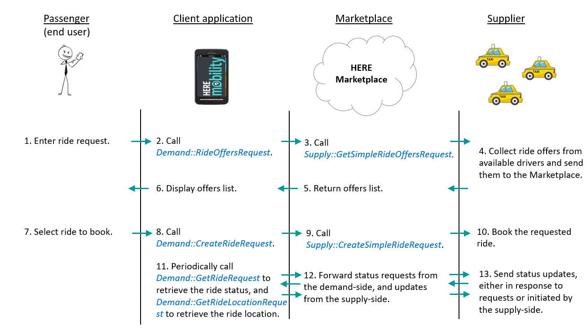

# HERE Mobility Platform Overview #

HERE Mobility aims to democratize the mobility ecosystem. We are creating a competitive marketplace powered by intelligent technological solutions for all mobility service providers, businesses, and consumers.

HERE’s central platform is the **HERE Mobility Marketplace**, a hub for supplying and requesting mobility services, for businesses and consumers. The Marketplace enables matching up end users with suppliers who can meet their needs for transportation and delivery.

The HERE Mobility platform offers two APIs: the **Demand API**, for use by client applications serving end users (passengers), and the **Supply API**, for use by applications representing ride suppliers such as taxi dispatching stations.

The **HERE Mobility Demand API** is a REST or GRPC API that enables the calling application to request, book and cancel mobility services. Demand API requests are sent to the HERE Mobility Marketplace, which matches up ride requests with available suppliers, and manages ride information and statuses.

The **HERE Mobility Supply API** is a REST or GRPC API that enables the HERE Mobility Marketplace to request and book rides from suppliers, and enables suppliers to send updates about rides in progress.

# Introduction to the HERE Supply API #	

## What is the Supply API? ##

Suppliers of the HERE Mobility Marketplace are taxi dispatchers (other types of transportation providers will be supported in the future). Suppliers manage a pool of taxi drivers, their locations, availability and ride bookings. Suppliers can use the HERE Supply API to:

- Receive a request for ride offers
- Receive a request to book a ride
- Cancel a ride, or receive a cancellation request from the passenger
- Send updates about a ride’s status

Using the HERE Demand API, end user applications send passengers’ ride requests, which indicate the numbers of passengers and suitcases that the ride must accommodate. The HERE Marketplace requests ride offers from suppliers via the Supply API, matches ride offers to ride requests, and sends the ride offers to the end user. The end user may then choose to book one of the ride offers. The supplier then sends updates to the Marketplace about the ride’s progress, and those updates are sent to the Demand API client.

## Technical Specifications ##

The Supply API is supported over the REST and GRPC protocols.

## Authentication ##

For security reasons, when you access the Here Mobility Demand API on behalf of your users, you will need to sign in with their username and with the Demand API App Key and App Secret values.

### Getting a Client-to-Service (C2S) Token ###

When calling the Client-to-Service (C2S) API, the best practice is for your backend server to sign in to the Demand API when the user logs in, and send the signed hash value to the app. The app should then pass the hash value to the Demand API. See the REST call in the following example:

    GET accounts.v1/application/c2s/token?application_key=<application_key>&user_id=<user_id>&expiration=<expiration>&hash=<hash>

>**Notes**:
>* The application_key and user_id values are plain strings (not converted to Base64 as when providing them to the hash function)
>* The expiration value determines when the authentication token expires (in seconds, since Epoch).

### Getting a Service-to-Service (S2S) Token ###

Here is an example of how to create a Service-to-Service (S2S) token:

    GET accounts.v1/application/s2s/token?application_key=<application_key>&&application_secret=<application_secret>

## Environments ##

While developing an application that calls the Supply API, you can work in development mode. To do this, you pass a non-production access code when making API calls. This refers the calls to a sandbox environment that manages mock objects (mock ride and booking requests).

When you’re finished developing and testing your application, you can switch to production mode, by passing a production access code. This refers your application’s API calls to the operational HERE Mobility Marketplace.

# Supply-Side API Calls #

The supply-side application must work with two types of API calls:

- Dispatch calls – the HERE Marketplace directs these calls to the supplier application, which must implement handlers for the calls. 
- Supply calls – the supplier application initiates these calls and sends them to the HERE Marketplace.

The table below describes both types of calls.

Type	| Name	| Description
:-------|:------|:-------------
Dispatch|	RequestOffers	|Request ride offers from the supplier.
Dispatch|	CreateRide	|Request the supplier to book a ride.
Dispatch|	CancelRide	|Cancel a ride (initiated by the passenger).
Dispatch|	GetRideStatus	|Get a ride’s status.
Supply|	UpdateRideStatus	|Send an update of a ride’s status.
Supply|	UpdateRideLocation	|Send an update of a ride’s location.
Supply|	UpdateRideVehicleAndDriver	|Send an update of a ride’s vehicle and/or driver.
Supply|	UpdateRideEta	|Send an update of a ride’s Estimated Time of Arrival (ETA).
Supply|	UpdateRidePrice	|Send an update of a ride’s price.
Supply|	CancelRide	|Cancel a ride (initiated by the driver or the supplier).

# Common Workflows #	

The diagram below illustrates the workflow for booking a ride and updating its status during the ride. 
 

The following sections describe the Supply API calls that the supply-side application makes when implementing common mobility workflows.

## Handling Requests for Rides ##

*To handle a request for a ride:*

1.	The HERE Marketplace calls **RequestOffers**, and your (supply-side) application handles the call. The request includes passenger details, pickup and dropoff locations, pickup time, and any special requirements such as the number of passengers or suitcases. Collect ride offers that match the request, and send the list of offers to the Marketplace.
2.	The Marketplace forwards the offer list to the demand-side application, which presents the list to the passenger.
3.	The passenger selects one of the offers. The demand-side application sends the booking request to the Marketplace.
4.	The Marketplace calls **CreateRide**, and your application handles the call. Book the call with the relevant driver.

## Sending Ride Statuses ##

Rides change their status as they progress through the booking, pickup and driving stages.

Rides can have one of the following status values:

Status|	Description
:-----|:------------
UNKNOWN|	Unknown status
PROCESSING|	Looking for a supplier
REJECTED|	The supplier cannot fulfill the ride request
ACCEPTED|	The supplier accepted the request; a driver is not yet assigned
DRIVER_ASSIGNED|	A driver has been assigned to the ride request
DRIVER_EN_ROUTE|	The vehicle is en route to the pickup location
AT_PICKUP|	The vehicle is at the pickup location
PASSENGER_ON_BOARD|	The passenger is onboard; the vehicle is en route to the dropoff location
AT_DROPOFF|	The vehicle is at the dropoff location
COMPLETED|	The ride was completed successfully
CANCELLED|	The ride was cancelled by the supplier or by the client.

The client application may request the current ride status, in which case your application will handle a **GetRideStatus** call. 

Your application can also initiate a status update by calling **UpdateRideStatus**.

## Cancelling a Ride ##

The client application may request to cancel a ride, in which case your application will handle a **CancelRide** call sent by the Marketplace. 

>**Note**: You may maintain a “no cancellation” policy, in which case passengers are not allowed to cancel a ride once it’s booked. Ride offers contain the cancellation policy, so that passengers are aware of it before creating a booking.

Your application can also initiate cancelling a ride (for example, if the driver needs to cancel the ride) by calling the supply-side **CancelRide** call.
